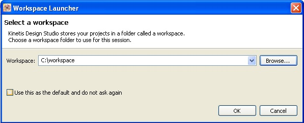
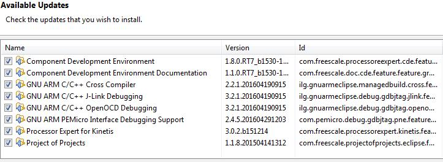
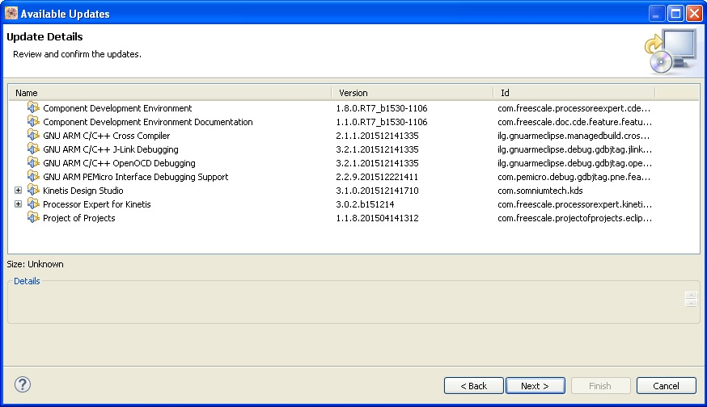
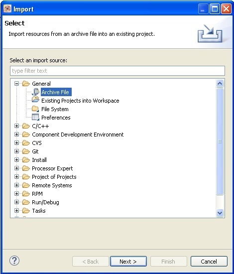
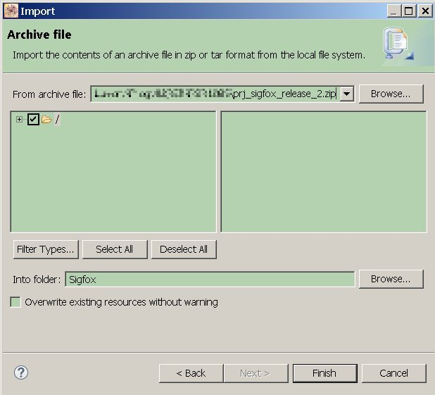
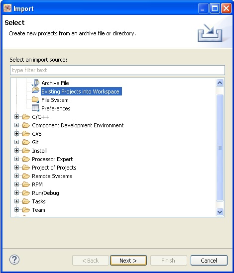
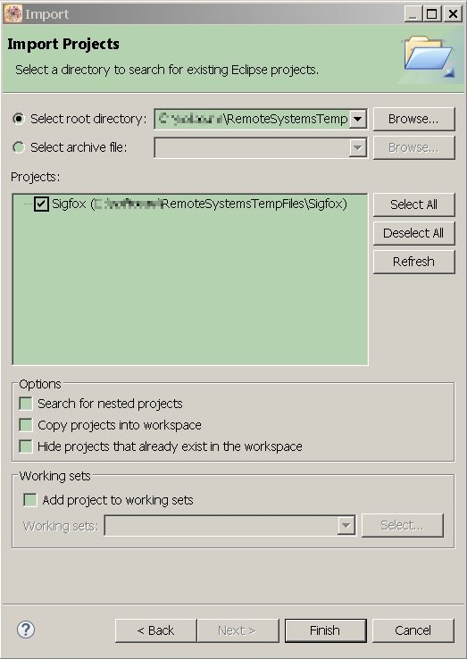
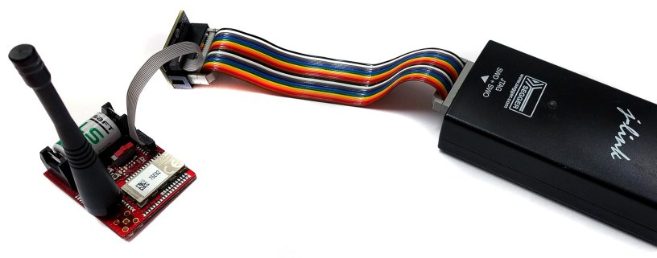
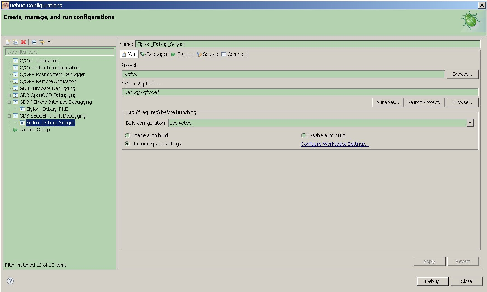

.. index:: development

.. _develop:

Developing guide
----------------

This guide will provide instructions to install the development environment needed to compile and debug the demo firmware of the Sensor Node Sigfox. The development system is multiplatform, it supports Windows and Linux. This guide is written using Windows.
The main steps are:

- Install Kinetis Design Studio

- Import build & debug the source project

Hardware required:

- Sensor Node Sigfox with battery

- Segger J-Link (`Segger website <https://www.segger.com/jlink_base.html>`_) with SWD debug interface

- PC with Windows or Linux

Install Kinetis Design Studio
*****************************

First up, register at the NXP website `registration form <https://www.nxp.com/webapp/crcl.ccr_register.framework?ACTION_TYPE=registerpage>`_ then you can download the IDE from `this page <http://www.nxp.com/products/software-and-tools/run-time-software/kinetis-software-and-tools/ides-for-kinetis-mcus/kinetis-design-studio-integrated-development-environment-ide:KDS_IDE>`_, we used Kinetis Design Studio **3.0.0**.

Therefore launch the downloaded file **Kinetis Design Studio installer for Microsoft Windows 3.0.0.exe** following all the default options. During the installation will be installed also SEGGER J-Link drivers.

If you want modify the project using **processor expert** it is required to install also the package KSDK 1.3.0 because with the installation of the Kinetis Design Studio 3.0.0 is installed the KSDK 1.2.0 version and it is not compatible with the project.

Launch KDS and select a directory for the workspace. In this folder will be imported our project. In this guide we used this path:

subsequently update the system to the version 3.1.0 clicking on **help->check for updates**. Check the box showed below and press **Next** button.

then press **Accept** and **Finish**. Will be installed all the updates avaiable, if required accept some request during the installing. In the end restart the IDE.

Import Project
**************

Go to **File->Import** and select **archive file**.

Browse to the zip file containing the project and select your workspace where put the source code.

The file will be unzipped. Now you have to import the source code going to **file->import** and selecting **Existing Projects into Workspace**

Select where is locate from:

Now you are ready to build and debug it.

Build & Debug
*************

Go to **Project->Build All**, to compile the entire project. Therefore in order to debug it connect the J-Link to the connector **CN4**. The debug interface used is **SWD**. Then turn on the board switching the **SW1**.

Always on the KDS click on **Run->Debug Confiuration->GDB Segger J-Link Debug**.

Clicking on **Debug** button the debug will start entering on the first line code of the **main()** function. During the debug session the sleeping mode doesn't work.

Processor Expert
****************

KSDK 1.3.0 is a graphic tool used for simplify the peripherals initialization of the MKL26Z microprocessor. We suggest you to install the 1.3.0 version if you want to change the source code. This project is bare metal.

