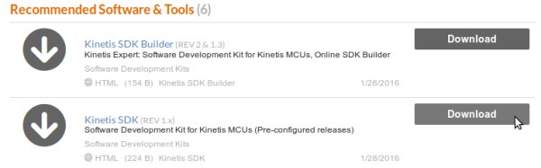
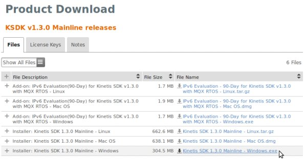
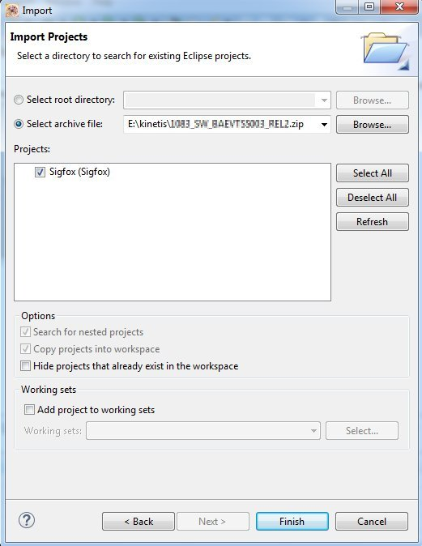
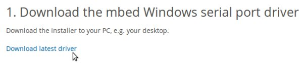

.. index:: development

.. _develop:

Developing guide
----------------

This guide will provide instructions to install the development environment needed to compile and debug the demo firmware of the Sensor Node Sigfox. The development system is multiplatform, it supports Windows and Linux. This guide is written using Windows.
The main steps are:

- Install Kinetis Design Studio 3.2.0, upgrade it and install KSDK 1.3.0

- Import build & debug the source project

Hardware required:

- Sensor Node Sigfox with battery or Mini-USB cable

- if you don't use Mini-USB cable Segger it is required a J-Link (`Segger website <https://www.segger.com/jlink_base.html>`_) with SWD debug interface.

- PC with Windows or Linux

Install & Update Kinetis Design Studio
**************************************

First up, register at the NXP website `registration form <https://www.nxp.com/webapp/crcl.ccr_register.framework?ACTION_TYPE=registerpage>`_ then you can download the IDE from `this page <http://www.nxp.com/products/software-and-tools/run-time-software/kinetis-software-and-tools/ides-for-kinetis-mcus/kinetis-design-studio-integrated-development-environment-ide:KDS_IDE>`_. Press on **Download** button.

.. image:: _static/download_kinetis_0.jpg

We used Kinetis Design Studio **3.2.0**, press on **Downloads for Kinetis Design Studio for Microsoft Windows**. 

.. image:: _static/download_kinetis_1.jpg

Agree the terms and download the file **Installer: Kinetis Design Studio 3.2.0 Installer for Windows**.

.. image:: _static/download_kinetis_3.jpg

Next, run the downloaded file **kinetis-design-studio_3.2.0.exe** following all the default options.

Launch KDS and select a directory for the workspace. Our project will be imported in this folder. In this guide we used this path:

.. image:: _static/kds_workspace.jpg

At this point, if you want to modify the project using **processor expert** it is required to install also the package **KSDK 1.3.0** in order to be compatible with the project. You can find this package on `KINETIS-SDK page <http://www.nxp.com/products/software-and-tools/run-time-software/kinetis-software-and-tools/development-platforms-with-mbed/software-development-kit-for-kinetis-mcus:KINETIS-SDK?code=KINETIS-SDK&nodeId=0152109D3F1E8C1EF7&fpsp=1&tab=Design_Tools_Tab>`_. Select Download button from **Kinetis SDK**.

Select **KSDK v1.3.0 Mainline releases**

.. image:: _static/download_kinetis_KSDK_2.jpg

Agree the terms and then download **Kinetis SDK 1.3.0 Mainline - Windows.exe**

Install it following all the default options, it will be installed into **C:\\Freescale\\KSDK_1.3.0**

Follow these steps:

1. Run KDS 3.2.0
2. Select Help -> Install New Software
3. Click on **Add...** button
4. Then click on **Archive** button
5. Now select from **C:\\Freescale\\KSDK_1.3.0\\tools\\eclipse_update** the file **KSDK_1.3.0_Eclipse_Update**
6. Select the package **KSDK 1.3.0 Eclipse Update**
7. Continue with the wizard. Accept the license agreement during the installation process.
8. Restart KDS

Now you are ready to import the project in your KDS.

Import Project
**************

Go to **File->Import** and select **Existing Projects into Workspace**.

.. image:: _static/kds_archive.jpg

Browse to the zip file containing the project and select the project.

Press on **Finish**. Now you are ready to build and debug it. There are two ways to debug the board, the easiest is debug it via USB.

Build & Debug via USB
*********************

With the Mini-USB connector you are able to use **OpenOCD** inteface. In order to use it download and install the drivers for windows from `mbed website <https://developer.mbed.org/handbook/Windows-serial-configuration>`_, 

After the installation, connect the sigfox-node board to the PC via **CN2** connector and turn on the board switching the **SW1**. Windows will recognize it.

Go to **Project->Build All**, to compile the entire project. Always on the KDS click on **Run->Debug Confiuration->Sigfox_Debug_OpenOCD**.

.. image:: _static/kds_debug_openocd.jpg

Clicking on **Debug** button the debug will start entering on the first line code of the **main()** function. During the debug session the sleeping mode doesn't work.

.. warning::

    Due some problem with KDS, sometimes you have to launch the debug twice before the KDS will run the debug correctly.

Build & Debug via SWD
*********************

Go to **Project->Build All**, to compile the entire project. In order to debug it connect the J-Link to the connector **CN4**. 

.. note::

    Connector **CN4** is not fitted on the sigfox-node board. It is a connector **SMD MALE STRIP 2x5 P1.27mm**. You have to fit it in order to debug the board via SWD.

The used debug interface is **SWD**. Then turn on the board switching the **SW1**.

.. image:: _static/board_jlink.jpg

Always on the KDS click on **Run->Debug Confiuration->GDB Segger J-Link Debug**.

Clicking on **Debug** button the debug will start entering on the first line code of the **main()** function. During the debug session the sleeping mode doesn't work.

Processor Expert
****************

The **Kinetis software development kit (KSDK)** is an extensive suite of robust hardware interface and hardware abstraction layers, peripheral drivers, RTOS abstractions, stacks, and middleware designed to simplify and accelerate application development on Freescale Kinetis MCUs. The addition of **Processor
Expert** technology for software and board configuration provides unmatched ease of use and flexibility. Included in the Kinetis SDK is full source code under a permissive open-source license for all hardware abstraction and peripheral driver software. Mainline releases include support for a collection of Kinetis
MCUs, whereas standalone releases offer support for one or a few additional Kinetis MCUs only. For details read `KSDK page <http://www.freescale.com/ksdk>`_.
