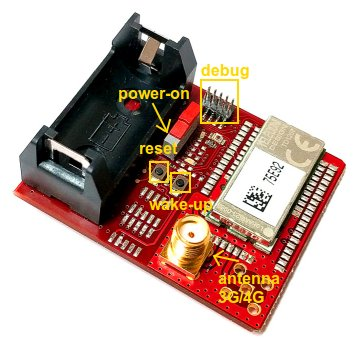

.. index:: hardware

.. _hardware:

Hardware Guide
--------------

The board is provided with:

- NXP MKL26Z microprocessor
- TD1207 Module Sigfox
- Light Sensor
- Reset button
- Wake-up button
- NXP FXOS8700CQR1 Accelerometer and Magnetometer sensor
- LEDs which one is used directly by KL26Z

The TD1207 module provides a protocol connectivity using a simple UART interface. The NXP **MKLS26Z** is connected to the TD1207 module using the configuration 9600 8N1 without using RTS, CTS lines.

The Light Sensor is read from the ADC converter pheriperal of the MKL26Z.

The Acclerometer sensor is read from I2C interface.

The microcontroller uses the deep sleep mode **VLPS**, it is waken up from LPTimer every 30 seconds or pin interrupt connected to the **S2** button.

The board
*********

Commands used
*************

In order to send data in the Lora network the command is:

- **AT$SS=18 AA BB CC**: used to send the frame *18AABBCC*

Datasheet and more
******************

Please refer to `architechboards <http://architechboards.org/>`_ website.

