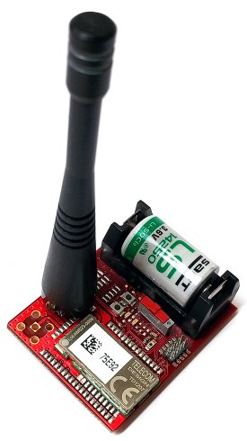

.. Sigfox_Silica documentation master file

Welcome to Sensor Node Sigfox documentation!
============================================

:Version: 1.00A
:Copyright: (C)2016 Silica an Avnet company
:Date: 05 Feb 2016

Sigfox’s Long Range Low Power End Node solution
-----------------------------------------------

.. index:: index

**INTRODUCTION**
----------------

Telecom Design’s **TD1207** devices are high performance, low current
SIGFOXTM gateways. The combination of a powerful radio transceiver and a
state-of-the-art ARM Cortex M3 baseband processor achieves extremely high
performance while maintaining ultra-low active and standby current
consumption. The **TD1207** device offers an outstanding RF sensitivity of –
126 dBm while providing an exceptional output power of up to +14 dBm with
unmatched TX efficiency. The **TD1207** device versatility provides the
gateway function from a local Narrow Band ISM network to the long-distance
Ultra Narrow Band SIGFOXTM network at no additional cost. The broad range
of analog and digital interfaces available in the **TD1207** module allows any
application to interconnect easily to the SIGFOXTM network. The LVTTL low-
energy UART, along with the numerous GPIOs can control any kind of
external sensors or activators. Featuring an AES encryption engine and a
DMA controller, the powerful 32-bit ARM Cortex-M3 baseband processor can
implement highly complex and secure protocols in an efficient environmental
and very low consumption way.

Features:

- SIGFOX READY
- Frequency range = ISM 868 MHz
- Receive sensitivity =-126 dBm
- Modulation: 
    - (G)FSK, 4(G)FSK, GMSK,
    - OOK
- Max output power: +14 dBm
- Low active radio power consumption: 
    - 13/16 mA RX, 
    - 37 mA TX @ +10 dBm
- Power supply = 2.3 to 3.3 V

Developement tools
******************

Firmware developed using:
NXP Kinetis Design Studio. For installation and configuration of the project, follow instruction inside :ref:`develop`

Document references
*******************

The board reference documentation is available on the `architech-board <http://architechboards.org>`_ website. 

Contents:

.. toctree::
   :maxdepth: 2

   develop
   hw

